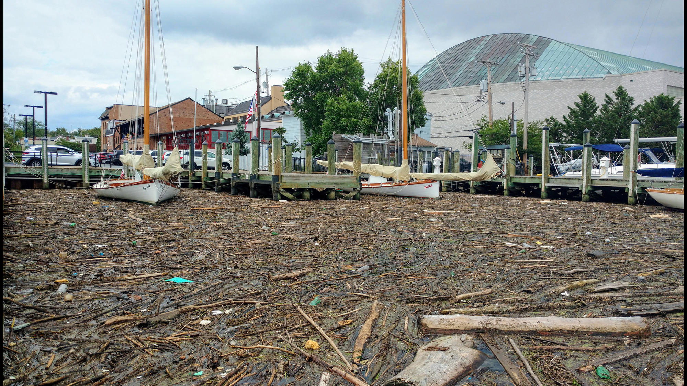

### GIS Maps from Google Earth to qGIS with STEM Anne Arundel County Middle School.
#### We want to keep the coastaline clean and debris from entering the waterway.

STEM Anne Arundel Middle School Students and a Mentor lead an effort to develop a marine debris pollution zone and cleanup prioritization
zone map. This map is focusing on the watersheds of the South and Severn River in Anne Arundel County.

The Student are a part of Team Breathing Water and first map draft they are heading to Sharktank in early January to pitch their
community project pursuit.

Nuisance flooding, storm surge and Conowingo Dam overflow prove to be a regular concern in the Annapolis area region.
Local students come together to direct the mitigation of the effort.

Here we start with a basic map outlining the South and Severn River.
Public parks are polygons in green and you see a streams layer.
The red contour near the coastline reflects the 8ft storm surge level from the infamous Hurrican Isabel of 2003. 

Next we will create a buffer surrounding the streams and coastline within a sea level to 8 foot elevation contour layer.

At that point we can really see where the problem spots are and relate whether known cleanup efforts are targeting these zones.

We will look at a number of sitting water runoff infrastructure in relation to our results.

The final maps will be presented to the Annapolis community by Team Breathing Water at the end of the school year.

Students will use this study to best develop a weather monitoring system that will inform the community of coastal pollution mitigation alerts.

