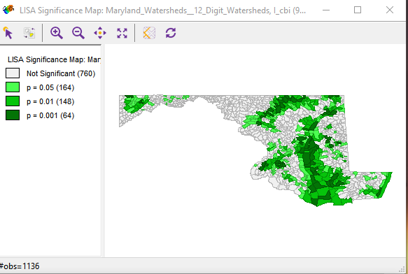
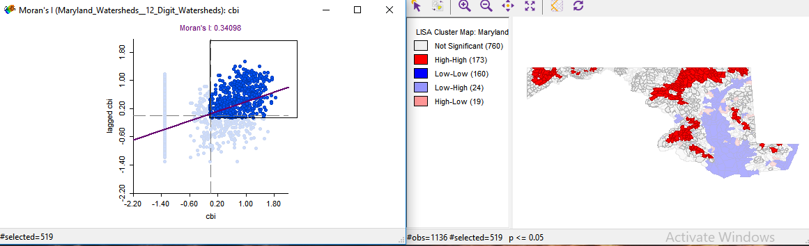
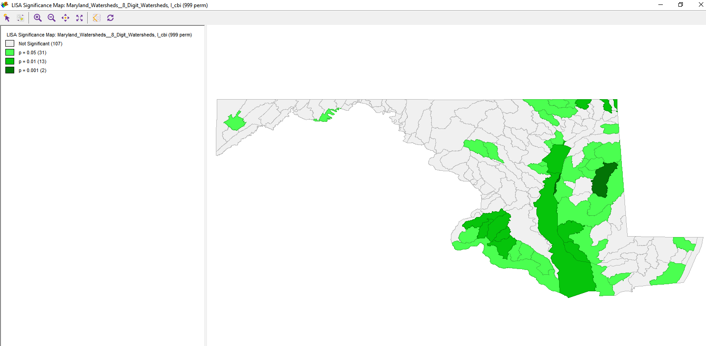
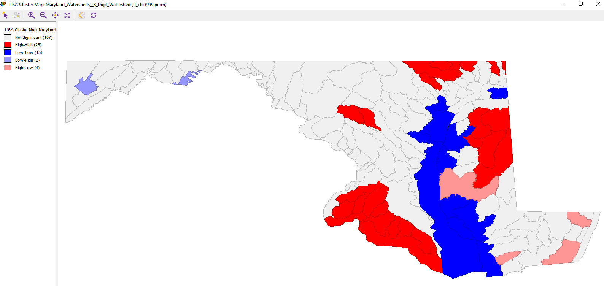
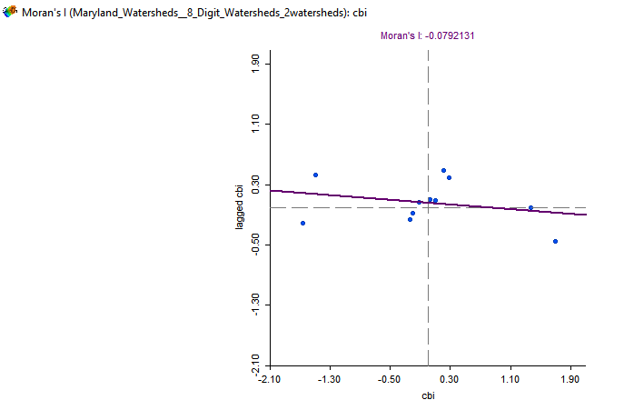
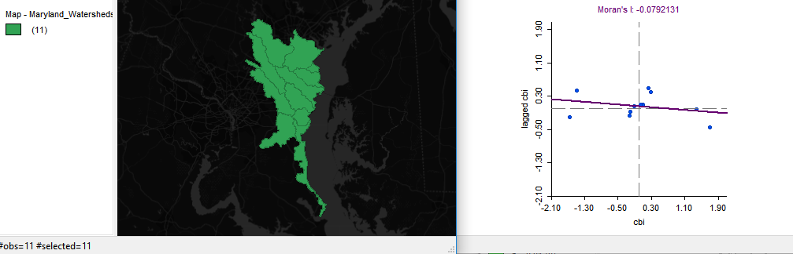

# P4 AACBI_L6

This is Lab 6. A lab meant to demonstrate the use of Geoda with a dataset to expierament with varying forms of spatial auto-correlation GUIs. I pursued taking what was discussed in Lab 6 with Geoda and applying it to a combined biotic index watershed dataset. I did this because I needed to have a sense of the health of the 2 watersheds that I am studying closer with a STEM middle school group. We are digging deep into looking at aspects of the watershed verse the coastal region of greatest incidence for marine debris pollution.

 

  

 

 

 

 

   
Instead of looking at Guerry region data I focused on a dataset to help me prepare in one of my final projects.

I wanted to assess the clustering, significance distribution and Moran's I Local value for a dataset that relays the health siginificance associatd wtih Maryland sub-watersheds. Good thing the Moran's I values overall are projected as positive towards healthier watersheds.
Though the watersheds I am paying most attention to didi not have a close spatial correlation nor any significant clustering.

  
