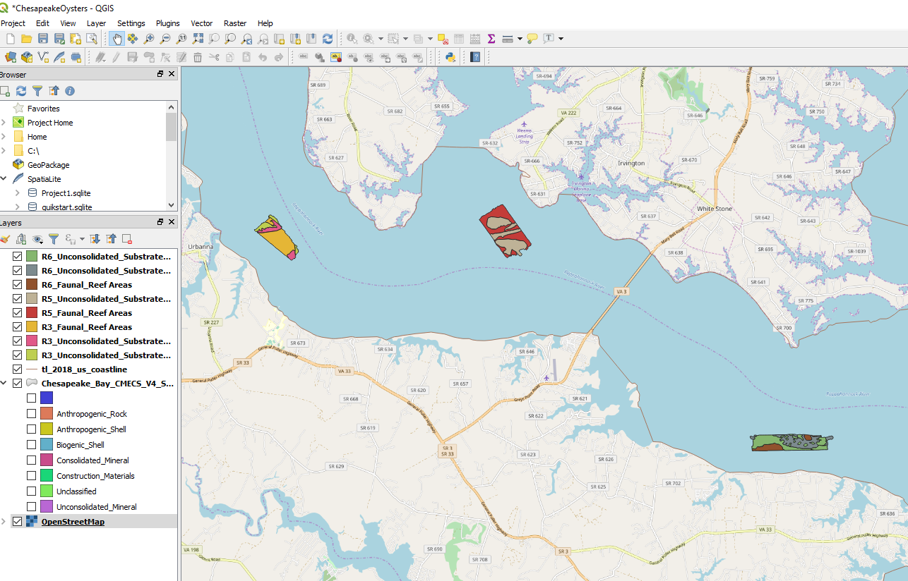
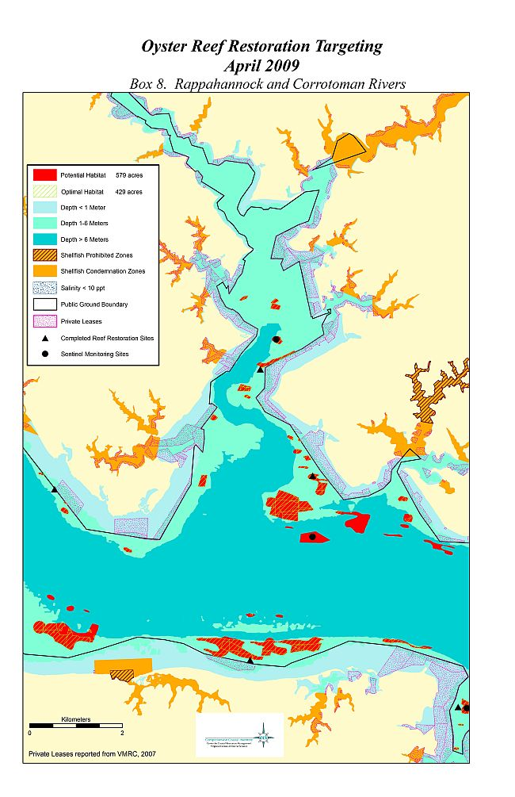
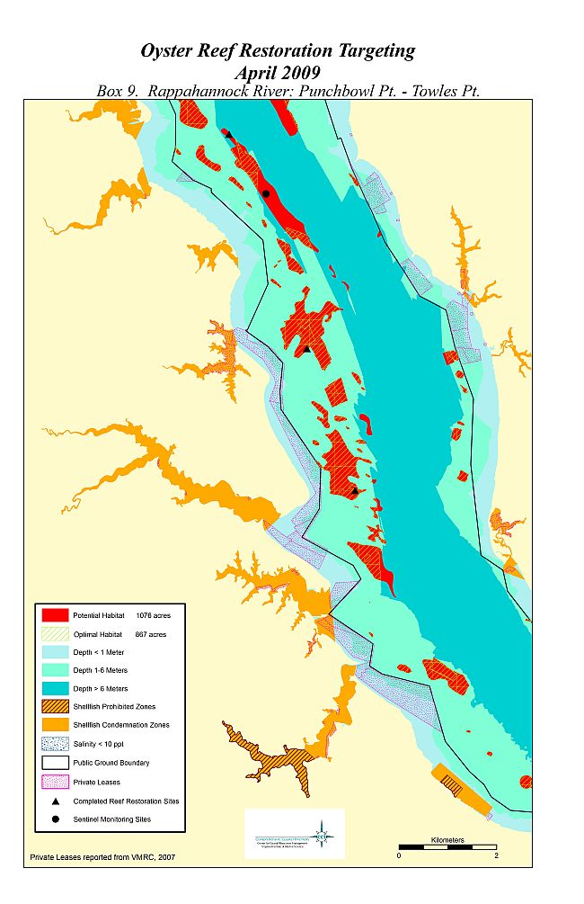

## Virginia's Rappahannock River Potential Oyster Restoration Site Survey

Data Submission Pending: NOAA Chesapeake Bay Office

The idea is to take my side scan sonar orthomosaics and the intensity range groundtruthed with sediment cores and to update a few unsurveyed spots of the Bay-wide Habitat Map

The final steps are geo-referencing the orthoimages and building up the attribute tables to reflect the [CMECS](https://iocm.noaa.gov/cmecs/) standard.

Virginia water bodies historic oyster private and public state boundaries are observed by VIMS and Virginia Marine Resource Commission.
http://www.vims.edu/research/units/labgroups/molluscan_ecology/restoration/va_restoration_atlas/rappahannock_punchbowl/index.php

