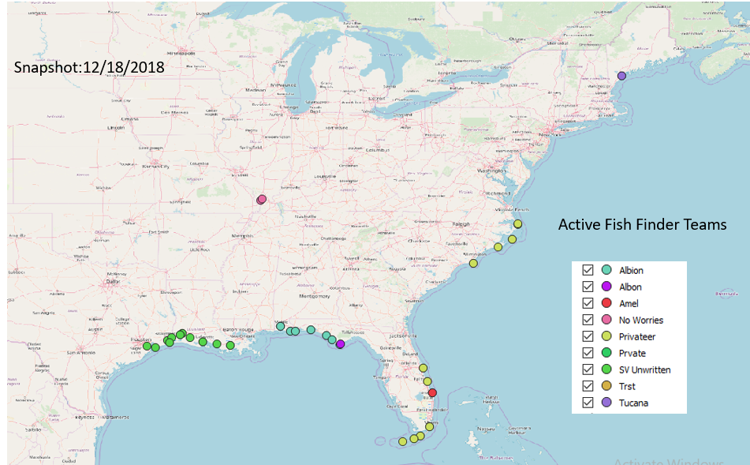

For a real time look at active Fish Finder monitoring locations.

<a href="https://orpteam.maps.arcgis.com/apps/webappviewer/index.html?id=c5085c49856d48a9b1e7d15ff60d1b9e" target="_blank">
  
  
 This is a snapshot of a Fish Finder team monitoring in various locations for tagged marine species from mid Fall to now 8/17/2018. Most of these teams are cruising on sailboats or poweryachts and having the time of their life with their friends and family while acting as observers for marine species activity.

An animation (Gif) will be uploaded to show Fish Finding team routes over time and space between 2014-2018.

Eventually, I will show detection data associated with the Fish Finder monitoring data and their performance metrics such as hours of monitoring verse detections. General maps of existing acoustic receiver arrays and tagging projects will be loaded to relate to Fish Finding areas.

Areas underrepresented by fixed bio-acoustic receiver monitoring locations that may have species return, a high frequency of detections interannual activity will be identified as key locations recreational mariners are optimal to support biodiversity monitoring activity.

If you want to know where the data is available check or the website below feel free to email me. 
[To learn more about the Fish Finder Program click this link.](http://www.oceanresearchproject.org/programs/science/citizen-science/)

