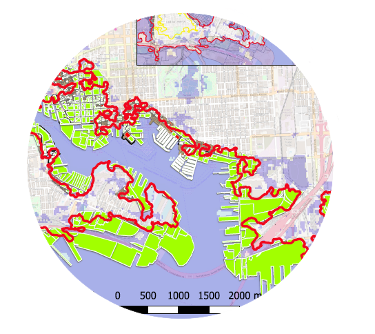
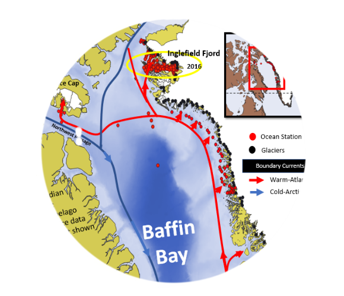
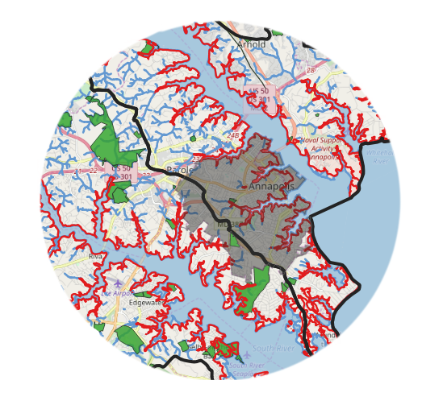
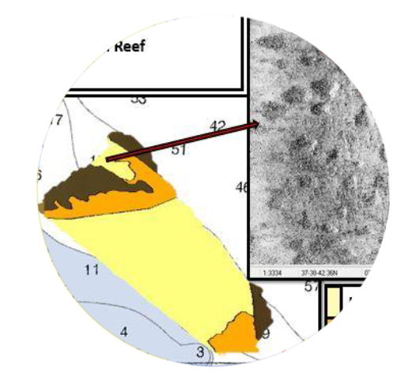

  Nicole Trenholm's UMBC Geographic Environmental Systems GIS Portfolio

<!--This is the first row of projects -->

### Around Year 3000 Baltimore Harbor and Sea Level Rise

 Here you see Baltimore Harbor affected by sea level rise. 
 Click on the Map and view  which neigborhoods and waterfront regions are most affected by sea level rise.
 [See more details here.](https://nicoletrenholm.github.io/P1_SLR/P1_SLR.html)
 
 <small>__Tools__: QGIS, Interpolation,</small>
 
 <small>__Data__: [Baltimore](https://supportland.com/), [DEM & Dillon](https://oregoncraftbeer.org/guild/)</small>
 
 

### Oceans Help Melt Glaciers: Expeditions 2015-2018

Here I take you to the glaciated melting fjords off Baffin Bay. A series of study sites impacted by incoming warm Atlantic currents in contact with Greenland and Canada's ocean terminaiting glaciers. We focus on Canada's Devon Ice Cap and the Croker Bay glaciers. [See more details here.](https://nicoletrenholm.github.io/P2_Glacier/Glacier.html)

 
 <small>__Tools__: QGIS, R</small>
 
 <small>__Data__: [Arctic Data](https://www.jpl and ORP), </small>

<!--This is the second row of projects -->

 ### STEM South River Middle School Students & Mentor Build Coastal Area Marine Debris Pollution Zone Map
 
 
 
 Here STEM South River Middle School Team, Breathing Water is led by Project Mentor Nicole Trenholm to develop a map for the Annapolis    area community. Together we will deterime coastal debris hotspots and potential high priority cleanup locations based on historic data.
  [See more details here.](https://nicoletrenholm.github.io/P3_STEMAA/STEMAA.html)
  
 <small>__Tools__: QGIS
 
 <small>__Data__: [Anne Arundel County GIS](https://supportland.com/), </small>
 

 
### State to Anne Arundel County Watershed Health Index Spatial Autocorrelation Study
 
 
In order to gauge the watershed health of the focus areas for Team Breathing Water's Project I needed to gauge the overall health of the sub-watersheds. [See more details here.](https://nicoletrenholm.github.io/P4_AACBI_L6/L6.html)
 
 <small>__Tools__: QGIS, Geodata
 
 <small>__Data__: [Watershed Data](https://needlinkhere)
 
 

<!--This is the second row of projects -->

### Mapping VA's Unclassified Oyster Habitat in the Rappahannock River for a NOAA Bay-Wide Map
 

Here is unclassified regions of the Rappahannock River being prepared for the NOAA Bay-wide CMECS Oyster Habitat Map after a habitat survey was conducted in 2014.
[See more details here.](https://nicoletrenholm.github.io/P5_VAHabMap/VAHabMap.html)

<small>__Tools__: QGIS
 
<small>__Data__: CMECS classiffication, Ocean Research Project hydrographic survey data, grab samples (Nicole Trenholm)

### Citizen Science: Recreational Mariners Monitored Tagged Marine Biodiversity Cruising Coastal Waters

There are dozens of recreational mariners that take to the coastline to fulfill a retiree or transients dream of exploring and sailing the US coastal waters, well until they are ready to take off around the world. Here sailors become monitoring stations for tagged marine species within the Fish Finder Program of Ocean Research Project and help monitor managed, endangered and invasive biodiversity. Data that is made available to the marine biologists who tagged the species in the first place. Here we watch their progress in monitoring the coastline. [See more details here.](https://nicoletrenholm.github.io/P7_FishFinder/ff.html)

<small>__Tools__: QGIS, ESRI Survey123
 
<small>__Data__: Ocean Research Project data from Survey123 Fish Finder app (Nicole Trenholm)
 

