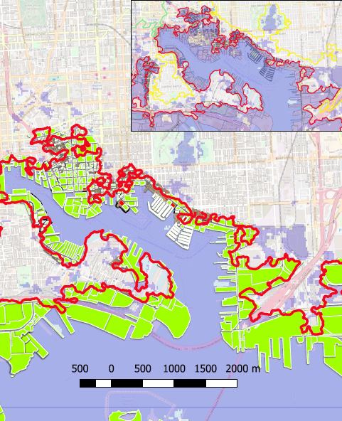
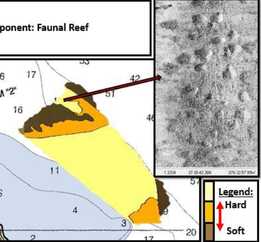
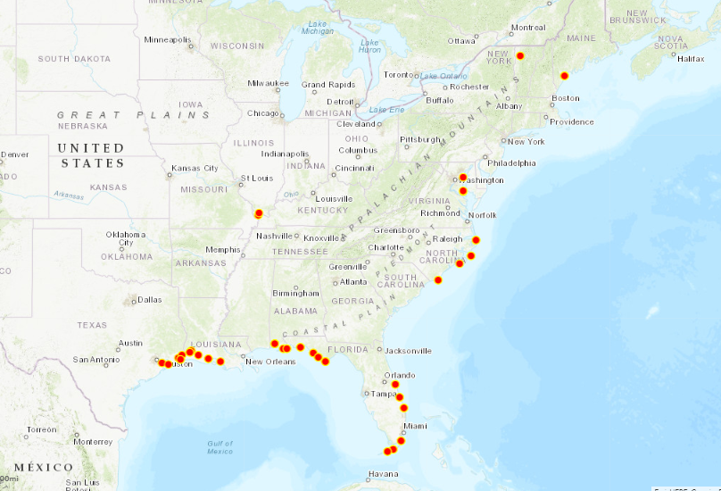

 Here you see Baltimore Harbor affected by sea level rise. [See more details here.](https://nicoletrenholm.github.io/P1_SLR/P1_SLR.html)
 Click on the Map and view  which neigborhoods and waterfront regions are most affected by sea level rise.
 
 <small>__Tools__: QGIS, Interpolation,</small>
 
 <small>__Data__: [Supportland](https://supportland.com/), [DEM & Dillon](https://oregoncraftbeer.org/guild/)</small>

 
  @@ -25,7 +26,7 @@ 
 

Here I take you to the glaciated melting fjords off Baffin Bay. A series of study sites impacted by incoming warm Atlantic currents in contact with Greenland and Canada's ocean terminaiting glaciers. We focus on Canada's Devon Ice Cap and the Croker Bay glaciers. [See more details here.](https://nicoletrenholm.github.io/P2_Glacier/Glacier.html)

 @@ -36,6 +37,7 @@ 
 
Notice I used markdown inside the html tags.
 <small>__Tools__: QGIS, R</small>
 
 <small>__Data__: [Arctic Data](https://www.jpl and ORP), </small>

 @@ -49,11 +51,12 @@ 
 
 
 
This example text that briefly describes the map. [See more details here.](https://nicoletrenholm.github.io/P3_STEMAA/STEMAA.html)
Here STEM South River Middle School Team, Breathing Water is led by Project Mentor Nicole Trenholm to develop a map for the Annapolis area community. Together we will deterime coastal debris hotspots and potential high priority cleanup locations based on historic data.
[See more details here.](https://nicoletrenholm.github.io/P3_STEMAA/STEMAA.html)
 
 <small>__Tools__: QGIS
 
 <small>__Data__: [Anne Arundel County GIS](https://supportland.com/), [State of MD Data](https://oregoncraftbeer.org/guild/)</small>
 
 
 @@ -65,9 +68,12 @@
 
 
 
 
 In order to gauge the watershed health of the focus areas for Team Breathing Water's Project I needed to gauge the overall health of the sub-watersheds. [See more details here.](https://nicoletrenholm.github.io/P4_AACBI_L6/L6.html)
 
 <small>__Tools__: QGIS, Geodata
 
 <small>__Data__: [Census Streets](https://www.census.gov/cgi-bin/geo/shapefiles/index.php), US Business Directory (defunct)</small>
 
@@ -49,11 +51,12 @@ 

Here is unclassified regions of the Rappahannock River being prepared for the NOAA Bay-wide CMECS Oyster Habitat Map after a habitat survey was conducted in 2014.

[See more details here.](https://nicoletrenholm.github.io/P5_VAHabMap/VAHabMap.html)
This example text that briefly describes the map. [See more details here.](https://nicoletrenholm.github.io/P5_VAHabMap/VAHabMap.html)

<small>__Tools__: QGIS
<small>__Data__:

@@ -49,11 +51,12 @@ 

There are dozens of recreational mariners that take to the coastline to fulfill a retiree or transients dream of exploring and sailing the US coastal waters, well until they are ready to take off around the world. Here sailors become monitoring stations for tagged marine species within the Fish Finder Program of Ocean Research Project and help monitor managed, endangered and invasive biodiversity. Data that is made available to the marine biologists who tagged the species in the first place. Here we watch their progress in monitoring the coastline. [See more details here.](https://nicoletrenholm.github.io/P7_FishFinder/ff.html)

<small>__Tools__: QGIS
 
<small>__Data__:
